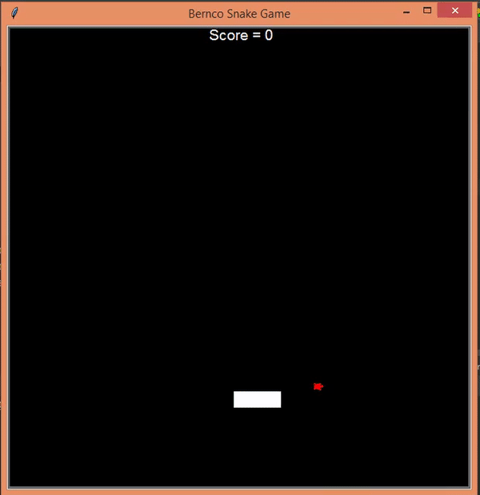

# snakegame-Python
OOP for snake game using turtle graphics.

<b /> class inheritance and super class manipulation
<b /> List and turple slicing

<b /> snake movement uses the arrow keys of the keyboard.
<b /> for any turtle eaten by the snake, the score is incremented by 1
<b /> edge collision is game over
<b /> body collision is also hame over

<b /> enjoy playing!

